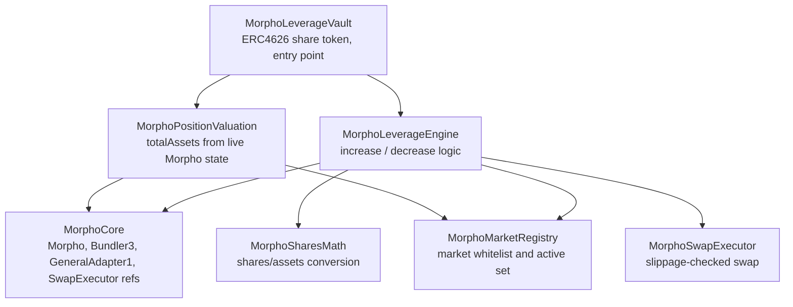
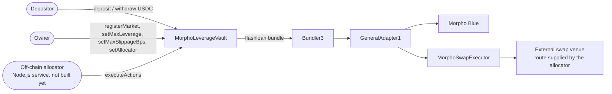
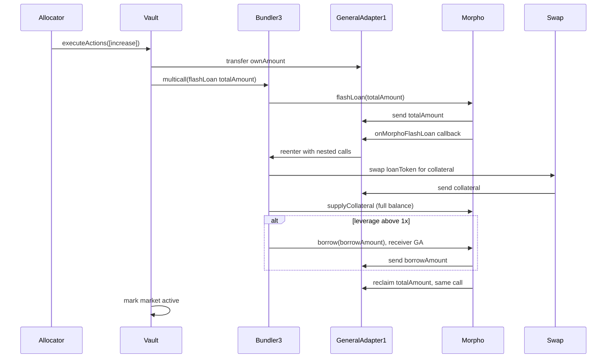
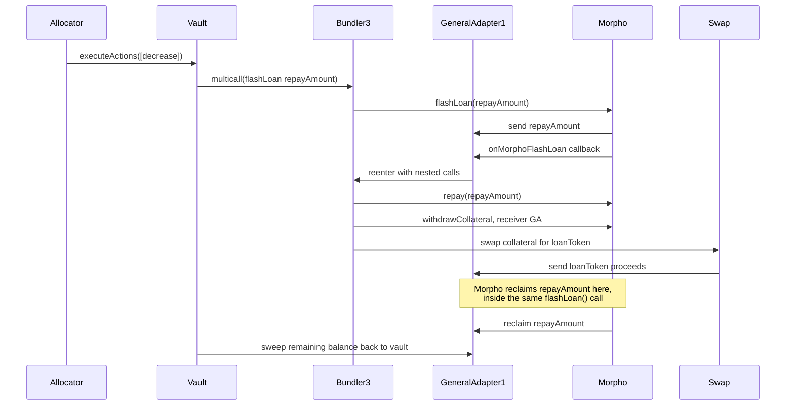
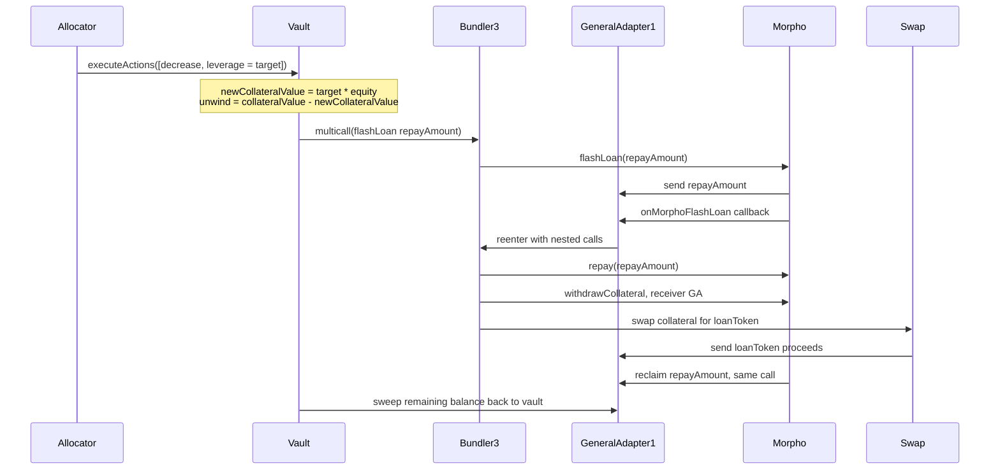

# Morpho Leverage Vault

An ERC4626 vault that opens and closes leveraged positions on Morpho Blue using flashloans, driven by instructions submitted from an off-chain allocator service.

## Status

The contracts and their test suite are complete and passing (84 tests, including fork tests and an adversarial audit suite that both run against real Arbitrum mainnet contracts). The off-chain allocator service that will actually drive the vault day to day has not been built yet. See [Status and roadmap](#status-and-roadmap).

## Overview

Depositors put a single asset (for example USDC) into the vault and receive shares, standard ERC4626 behavior. The vault owner whitelists Morpho Blue markets it is allowed to hold positions in and sets a maximum leverage ceiling for each one. An allocator, a separate role from the owner, submits instructions telling the vault to open, add to, or reduce positions in those markets, choosing the actual leverage for each increase itself, as long as it stays under the market's ceiling.

Leverage is achieved through a single atomic flashloan rather than repeated supply and borrow loops. One transaction borrows the extra capital, swaps it into collateral, supplies the collateral, and borrows against it to repay the flashloan, all inside one Morpho Blue flashloan callback. A market can also be registered at 1x, in which case the vault just supplies collateral with no borrow at all.

Swaps are done through an arbitrary external venue supplied by the allocator (a DEX aggregator quote, typically). The vault does not pick the route, but it does refuse any fill that lands too far below the market oracle's price. See [Safety model](#safety-model).

## Architecture

The vault is composed from a few focused pieces rather than one large contract:



- **MorphoLeverageVault**: the deployed contract. ERC4626 share token, owner-gated market admin, and the `executeActions` entry point the allocator calls.
- **MorphoLeverageEngine**: builds and executes the flashloan bundles for opening and closing positions.
- **MorphoMarketRegistry**: the whitelist of markets the vault may hold positions in, plus tracking of which ones currently have a real position (the active set).
- **MorphoPositionValuation**: reads live Morpho state to value every active position, which feeds `totalAssets` and therefore share pricing.
- **MorphoSharesMath**: Morpho Blue's own shares/assets conversion math, reimplemented locally so this project has no dependency on the Morpho Blue repo.
- **MorphoSwapExecutor**: a small standalone contract that executes one swap through an arbitrary target and enforces a minimum output.

## Actors and system flow



Bundler3 and GeneralAdapter1 are Morpho's own official infrastructure for composing multiple Morpho calls, plus a flashloan, into one transaction. They are not part of this project. This project's engine builds the list of calls; Bundler3 and GeneralAdapter1 execute them.

## Opening a position

`executeActions` is called with one or more `MarketAction` entries. For an increase, `action.amount` is the vault's own contribution, not the total position size, and `action.leverage` is the leverage the allocator wants for this specific call. Total exposure and the borrow amount are derived from those two numbers. The vault checks `action.leverage` against the market's `maxLeverage` ceiling before doing anything else; different calls, even in the same transaction, can request different leverage on the same market, with no owner transaction needed as long as they stay under the ceiling.



At exactly 1x leverage, `borrowAmount` is zero and the borrow step is skipped entirely rather than called with a zero amount, since Morpho Blue's `borrow()` reverts if both `assets` and `shares` are zero.

Requesting less than 1x or more than the market's ceiling reverts before any of this runs, with `LeverageBelowOneX` or `LeverageExceedsMax`.

## Closing or reducing a position

A decrease has two modes, selected by `action.leverage`. With `leverage == 0`, `action.amount` is an explicit collateral amount to withdraw, and debt is repaid proportionally to how much collateral comes out. With `leverage >= 1e18`, `action.amount` is ignored and the position is instead deleveraged down to that target ratio in place, covered in the next section.

Either `type(uint256).max` or the exact current collateral balance means a full close, and both take the same path: repay the precise borrow shares rather than a rounded asset estimate, so no dust debt is left behind. A decrease too small to repay anything is rejected rather than silently pulling collateral out for free.



The note in that diagram matters: Morpho Blue's `flashLoan()` sends the loan, runs the callback, and reclaims the loan back, all inside one external call. Anything meant to cover that reclaim has to already be sitting on GeneralAdapter1 before the callback returns. That is why the swap proceeds land on GeneralAdapter1 during a decrease, not on the vault directly, and why the leftover is swept back to the vault only afterward, as a "whatever remains" transfer rather than a precomputed amount, since real swap slippage means the exact leftover is not known in advance.

If a position has no debt at all, either because it is a 1x position or because it has already been fully repaid, the decrease skips the flashloan entirely and just withdraws and swaps directly.

## Deleveraging a position in place

Reducing exposure and reducing leverage are different operations. Withdrawing collateral proportionally (the mode above) shrinks a position while keeping its leverage ratio the same. Bringing a 2x position down to 1.5x without closing it needs something else: shrink the position using only its own collateral, holding the underlying equity fixed.

The math: leverage is `collateral / equity`, where `equity = collateral - debt`. To hit a target leverage while holding equity constant, the new collateral value has to be `target * equity`. The difference between that and the current collateral is exactly how much collateral to unwind, swap, and use to repay debt, nothing more. No capital comes from or returns to idle balance beyond whatever the swap delivers above `action.minOut`.



This reuses the exact same bundle shape as a plain decrease, since the same constraint applies: Morpho's `withdrawCollateral` checks position health immediately, against whatever debt is on the books at that moment. Debt has to come down before collateral comes out, which is why this needs a flashloan too, not a simple "withdraw then repay."

The repay amount is computed in Morpho's own share unit, not derived from a separately-rounded value estimate. Converting a value estimate back into an asset amount can, at small margins, round to slightly more shares than the position actually has, and Morpho's repay call reverts outright rather than partially filling. Computing directly in shares keeps the repay amount inherently bounded by what's actually outstanding.

`action.minOut` does the same job here as everywhere else: it is the floor on the collateral-to-loanToken swap. Set it below the computed repay amount and a bad fill reverts cleanly in the swap executor, instead of failing later when the flashloan can't be covered. A target of exactly `1e18` pays off all debt using exact shares (same reasoning as a full close) but still leaves collateral behind, since only the debt side ends up at zero, not the whole position. Requesting a target at or above the position's current leverage reverts with `TargetLeverageNotBelowCurrent`; there is nothing to unwind in that direction.

## Safety model

The allocator is a hot key that picks both the swap venue and the calldata sent to it. The system is built so that a compromised allocator cannot drain the vault, rather than assuming it stays honest.

**Oracle-anchored swap floor.** Every swap leg's minimum output is computed inside the contract from the market's own Morpho oracle, less that market's `maxSlippageBps`. The allocator's `minOut` is only ever raised to meet that floor, never allowed to lower it, so routing through a venue the allocator controls cannot settle at an arbitrary price. `maxSlippageBps` is per market, owner-set, and hard-capped at 10% by the registry.

**Per-call value check.** `executeActions` records `totalAssets()` before and after and reverts if the call destroyed more than `actionDropToleranceBps` (default 1%, owner-set, hard-capped at 10%). Any action is close to value-neutral in principle, since it just converts idle capital into an equally valuable position or back. This is the backstop for anything the per-swap floor misses, including losses spread across several actions in one call.

**Shortfalls are netted, not floored.** A position whose debt exceeds its collateral has negative value. `totalAssets()` subtracts that shortfall from the vault total, including from idle balance, rather than reporting the position as merely worth zero. Otherwise the share price would overstate solvency by the size of the shortfall, and since idle balance stays withdrawable, whoever redeemed first would exit at that stale price and leave the loss to everyone who waited. The total floors at zero rather than underflowing if a shortfall ever exceeds everything the vault holds.

**A failing oracle degrades valuation instead of halting the vault.** `totalAssets()` reads every active market's oracle, so a single reverting oracle used to block deposits and withdrawals for everyone, including against idle balance unrelated to that market. An unpriceable market's collateral is now valued at zero while its debt still counts, which can only under-report, never over-report, so nobody can redeem at a price the vault cannot substantiate. `isMarketPriceable(id)` tells an operator whether a low valuation means "worth little" or "cannot currently see". Increases and deleverages against that market still revert, since neither can derive a safe swap floor without a price.

**Swap executor is bound to one vault.** `MorphoSwapExecutor` is deployed by the vault itself, so it records that vault as its only authorized user. Because it runs inside a Bundler3 bundle, `msg.sender` is Bundler3 rather than the vault, and Bundler3 is permissionless. It therefore authorizes on the bundle's `initiator()` being its own vault, which no outside caller can forge. Both token balances are also swept to the vault before returning, so a router that under-consumes its allowance never leaves anything behind.

Known gaps, not yet addressed:

- Nothing on-chain enforces an idle buffer, so depositors can only withdraw whatever the allocator happens to have left uninvested. Keeping enough idle to honor redemptions is the off-chain engine's job.
- A liquidation is visible in valuation after the fact but nothing on-chain prevents one. Monitoring position health is also the off-chain engine's job.

## Repository layout

```
src/morpho/
  MorphoLeverageVault.sol        the deployed contract
  interfaces/                    minimal interfaces to real Morpho Blue, Bundler3,
                                  GeneralAdapter1, and oracle contracts
  types/
    MorphoTypes.sol              MorphoMarketConfig, MarketAction
  libraries/
    MorphoCore.sol                shared external contract references
    MorphoMarketRegistry.sol      market whitelist and active-set tracking
    MorphoPositionValuation.sol   live position valuation
    MorphoSharesMath.sol          Morpho Blue's shares/assets math
    MorphoSwapExecutor.sol        slippage-checked swap execution
    MorphoLeverageEngine.sol      flashloan bundle construction and execution

test/
  unit/                          pure Solidity tests, local mocks, no network access
  mocks/                         MockERC20, MockSwapRouter
  fork/                          integration tests against real Arbitrum Morpho Blue,
                                  Bundler3, and GeneralAdapter1
  audit/                         adversarial tests, one per attack hypothesis, each
                                  either demonstrating a flaw or proving it is blocked
```

## Testing

Unit tests cover math, market registry access control, swap execution, and vault ERC4626 accounting, all against local mocks:

```shell
forge test --match-path 'test/unit/*'
```

Fork tests exercise the actual flashloan mechanics against real deployed contracts on Arbitrum. Only the swap venue is mocked; everything else is the real Morpho Blue, Bundler3, and GeneralAdapter1. This is deliberate: Bundler3's reentry and callback verification, and GeneralAdapter1's internal behavior, are real audited logic that this project did not write, so faking them with a hand-rolled mock would only test assumptions about how they behave, not the real thing. Two real bugs in this project's own contract were only found this way, not by the unit tests.

Fork tests need an archive-capable RPC endpoint in `ARBITRUM_RPC_URL`. The public `arb1.arbitrum.io` endpoint only retains a few thousand blocks of history and cannot serve the pinned block these tests fork from. Use a free-tier key from Alchemy, Infura, or QuickNode instead. Fork tests fail loudly if `ARBITRUM_RPC_URL` is unset rather than silently skipping.

```shell
cp .env.example .env   # fill in an archive RPC URL
forge test --match-path 'test/fork/*'
```

Full suite:

```shell
forge test
```

## Setup

```shell
forge install
forge build
```

Copy `.env.example` to `.env` and fill in `ARBITRUM_RPC_URL` before running fork tests.

## Status and roadmap

Done:
- Vault, leverage engine, registry, valuation, swap executor, and their tests.
- Verified against real Arbitrum mainnet Morpho Blue, Bundler3, and GeneralAdapter1 deployments.

Not built yet:
- **Off-chain allocator service (Node.js)**. This is the piece that watches vault and market state, decides when and how much to increase or decrease, fetches swap quotes from a DEX aggregator, builds `MarketAction[]` calldata, and calls `executeActions`. The contracts assume this exists and trust it within the bounds of the `enabled` whitelist and the allocator role; none of that decision-making logic lives on-chain today.
- Deployment scripts (`script/` is currently empty).
- Any monitoring, alerting, or liquidation-risk tracking for open positions.
