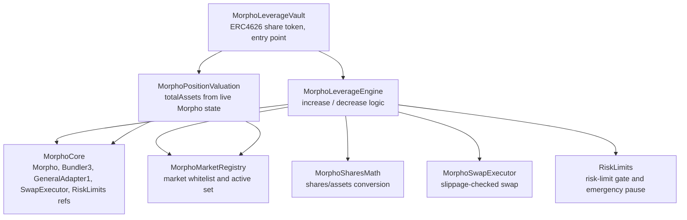
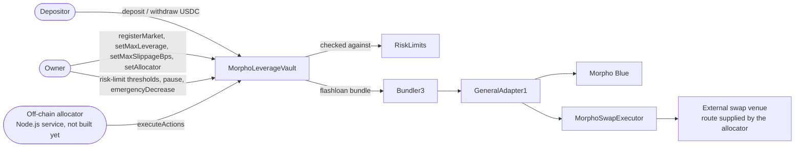
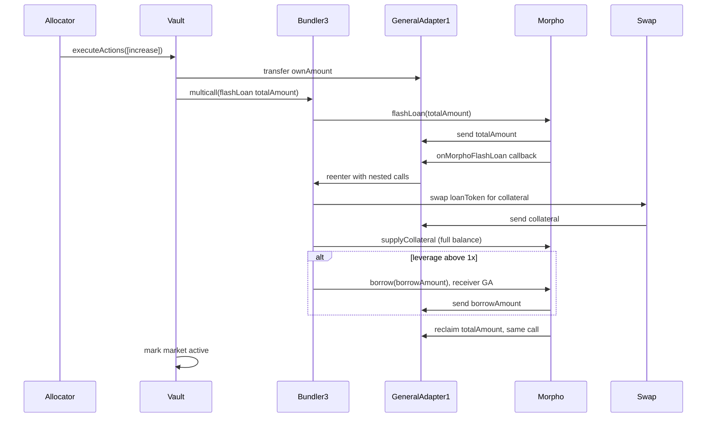
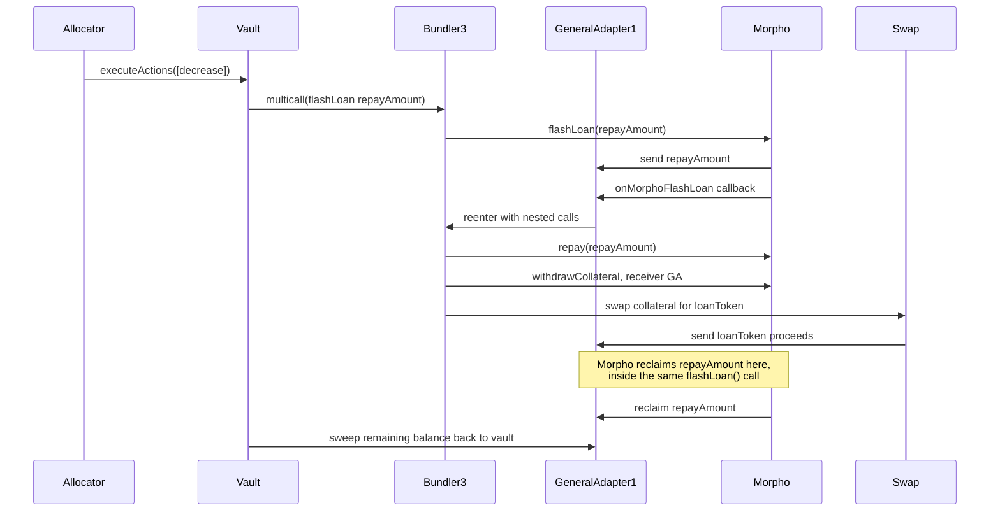
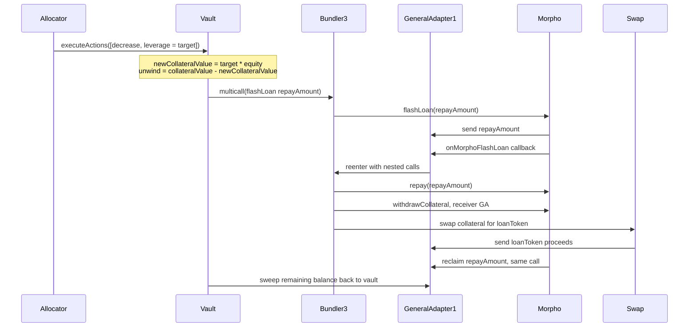

# Morpho Leverage Vault

An ERC4626 vault that opens and closes leveraged positions on Morpho Blue using flashloans, driven by instructions submitted from an off-chain allocator service.

## Status

The contracts and their test suite are complete and passing (129 tests, including fork tests and an adversarial audit suite that both run against real Arbitrum mainnet contracts). The off-chain allocator service that will actually drive the vault day to day has not been built yet. See [Status and roadmap](#status-and-roadmap).

## Overview

Depositors put a single asset (for example USDC) into the vault and receive shares, standard ERC4626 behavior. The vault owner whitelists Morpho Blue markets it is allowed to hold positions in and sets a maximum leverage ceiling for each one. An allocator, a separate role from the owner, submits instructions telling the vault to open, add to, or reduce positions in those markets, choosing the actual leverage for each increase itself, as long as it stays under the market's ceiling.

Leverage is achieved through a single atomic flashloan rather than repeated supply and borrow loops. One transaction borrows the extra capital, swaps it into collateral, supplies the collateral, and borrows against it to repay the flashloan, all inside one Morpho Blue flashloan callback. A market can also be registered at 1x, in which case the vault just supplies collateral with no borrow at all.

Swaps are done through an arbitrary external venue supplied by the allocator (a DEX aggregator quote, typically). The vault does not pick the route, but it does refuse any fill that lands too far below the market oracle's price. See [Safety model](#safety-model).

A separate `RiskLimits` contract adds owner-configurable risk limits on top of what the registry already gates — minimum health factor, aggregate debt and per-asset exposure caps, price-deviation sanity checks, and rate limiting — and gives the owner an emergency exit that works even if RiskLimits itself is misconfigured. See [Risk limits](#risk-limits).

## Architecture

The vault is composed from a few focused pieces rather than one large contract:



- **MorphoLeverageVault**: the deployed contract. ERC4626 share token, owner-gated market admin, and the `executeActions` entry point the allocator calls.
- **MorphoLeverageEngine**: builds and executes the flashloan bundles for opening and closing positions.
- **MorphoMarketRegistry**: the whitelist of markets the vault may hold positions in, plus tracking of which ones currently have a real position (the active set).
- **MorphoPositionValuation**: reads live Morpho state to value every active position, which feeds `totalAssets` and therefore share pricing.
- **MorphoSharesMath**: Morpho Blue's own shares/assets conversion math, reimplemented locally so this project has no dependency on the Morpho Blue repo.
- **MorphoSwapExecutor**: a small standalone contract that executes one swap through an arbitrary target and enforces a minimum output.
- **RiskLimits**: a second, independently-configurable risk-limit gate the engine consults on every action. See [Risk limits](#risk-limits).

## Actors and system flow



Bundler3 and GeneralAdapter1 are Morpho's own official infrastructure for composing multiple Morpho calls, plus a flashloan, into one transaction. They are not part of this project. This project's engine builds the list of calls; Bundler3 and GeneralAdapter1 execute them.

## Opening a position

`executeActions` is called with one or more `MarketAction` entries. For an increase, `action.amount` is the vault's own contribution, not the total position size, and `action.leverage` is the leverage the allocator wants for this specific call. Total exposure and the borrow amount are derived from those two numbers. The vault checks `action.leverage` against the market's `maxLeverage` ceiling before doing anything else; different calls, even in the same transaction, can request different leverage on the same market, with no owner transaction needed as long as they stay under the ceiling.



At exactly 1x leverage, `borrowAmount` is zero and the borrow step is skipped entirely rather than called with a zero amount, since Morpho Blue's `borrow()` reverts if both `assets` and `shares` are zero.

Requesting less than 1x or more than the market's ceiling reverts before any of this runs, with `LeverageBelowOneX` or `LeverageExceedsMax`.

## Closing or reducing a position

A decrease has two modes, selected by `action.leverage`. With `leverage == 0`, `action.amount` is an explicit collateral amount to withdraw, and debt is repaid proportionally to how much collateral comes out. With `leverage >= 1e18`, `action.amount` is ignored and the position is instead deleveraged down to that target ratio in place, covered in the next section.

Either `type(uint256).max` or the exact current collateral balance means a full close, and both take the same path: repay the precise borrow shares rather than a rounded asset estimate, so no dust debt is left behind. A decrease too small to repay anything is rejected rather than silently pulling collateral out for free.



The note in that diagram matters: Morpho Blue's `flashLoan()` sends the loan, runs the callback, and reclaims the loan back, all inside one external call. Anything meant to cover that reclaim has to already be sitting on GeneralAdapter1 before the callback returns. That is why the swap proceeds land on GeneralAdapter1 during a decrease, not on the vault directly, and why the leftover is swept back to the vault only afterward, as a "whatever remains" transfer rather than a precomputed amount, since real swap slippage means the exact leftover is not known in advance.

If a position has no debt at all, either because it is a 1x position or because it has already been fully repaid, the decrease skips the flashloan entirely and just withdraws and swaps directly.

## Deleveraging a position in place

Reducing exposure and reducing leverage are different operations. Withdrawing collateral proportionally (the mode above) shrinks a position while keeping its leverage ratio the same. Bringing a 2x position down to 1.5x without closing it needs something else: shrink the position using only its own collateral, holding the underlying equity fixed.

The math: leverage is `collateral / equity`, where `equity = collateral - debt`. To hit a target leverage while holding equity constant, the new collateral value has to be `target * equity`. The difference between that and the current collateral is exactly how much collateral to unwind, swap, and use to repay debt, nothing more. No capital comes from or returns to idle balance beyond whatever the swap delivers above `action.minOut`.



This reuses the exact same bundle shape as a plain decrease, since the same constraint applies: Morpho's `withdrawCollateral` checks position health immediately, against whatever debt is on the books at that moment. Debt has to come down before collateral comes out, which is why this needs a flashloan too, not a simple "withdraw then repay."

The repay amount is computed in Morpho's own share unit, not derived from a separately-rounded value estimate. Converting a value estimate back into an asset amount can, at small margins, round to slightly more shares than the position actually has, and Morpho's repay call reverts outright rather than partially filling. Computing directly in shares keeps the repay amount inherently bounded by what's actually outstanding.

`action.minOut` does the same job here as everywhere else: it is the floor on the collateral-to-loanToken swap. Set it below the computed repay amount and a bad fill reverts cleanly in the swap executor, instead of failing later when the flashloan can't be covered. A target of exactly `1e18` pays off all debt using exact shares (same reasoning as a full close) but still leaves collateral behind, since only the debt side ends up at zero, not the whole position. Requesting a target at or above the position's current leverage reverts with `TargetLeverageNotBelowCurrent`; there is nothing to unwind in that direction.

## Risk limits

`RiskLimits` is a second contract the engine consults on every allocator action, deployed 1:1 with the vault exactly like `MorphoSwapExecutor` (`MorphoCore`'s constructor deploys it, and it records the vault as its only trusted caller). It does not decide *which* markets are usable or *how much* leverage a single increase may request — `MorphoMarketRegistry`'s whitelist and per-market `maxLeverage` already own that, checked inline by the engine before any of this ever runs. RiskLimits adds thresholds that don't exist anywhere else: how much exposure the vault carries in aggregate, how fast it can grow, and whether a price it's about to trust looks sane.

Checks it enforces, all owner-configurable and all fail-open (default `0` = unenforced) until set:

- **Minimum health factor per market.** `collateralValue * lltv / debtValue`, Morpho Blue's own health-check formula, using `lltv` from `MarketParams` (otherwise unused anywhere else in this codebase). Checked immediately after an increase executes, using a freshly-read oracle price rather than the price the swap floor was computed from, since this is a post-trade solvency check and a stale price would be the wrong thing to pair with fresh collateral/debt numbers.
- **Maximum aggregate debt and per-collateral-asset exposure.** Summed across every active market after an increase. There is no equivalent per-borrow-asset cap: every registered market's `loanToken` already equals the vault's single `ASSET`, so there is only ever one borrow-side asset in this system by construction — aggregate debt already is that check.
- **A realized-slippage ceiling, global.** Measured after the fact, not assumed: the engine compares the collateral the position actually gained against what the oracle said the same loan tokens were worth, and reports that shortfall in bps. The registry's per-market `maxSlippageBps` bounds what a trade is *allowed* to lose before it executes; this bounds what it *did* lose, so a ceiling tighter than a market's own limit rejects bad fills while letting clean ones through.
- **Price-deviation limits, per market.** Records the price observed on every increase *and* decrease, and reverts if a new observation has moved more than a configured percentage since the last one. Observations older than `priceObservationMaxAge` are ignored rather than enforced against: across a long enough gap a threshold measures cumulative drift, which is indistinguishable from a break, so an anchor from months ago would reject legitimate increases into any market that had simply been left alone. This is a self-referential sanity check, not a manipulation-proof defense: Morpho's `IOracle` is spot price only, with no history, so there is nothing to cross-check against except what this contract itself last saw. An attacker moving the price by less than the configured tolerance, across several calls, or into a market with no anchor yet, is not caught by this alone.
- **Rate limiting on exposure growth.** A fixed-window counter per market caps how much *net* exposure growth (in `ASSET` terms) a market can absorb per window. Increases consume budget and decreases release it, saturating at zero. Netting rather than counting gross churn is deliberate: charging an unwind would mean a de-risking allocator locks itself out of re-entering the market it just made safer, worst precisely during the volatility that prompted the unwind. Known tradeoff of the fixed window: acting right at a window's end and again right after the next one starts can admit close to twice the nominal cap. A cap cannot be set while the window is still zero, since a zero window silently turns a per-window budget into a per-action one.
- **A global pause**, blocking new increases everywhere while leaving decreases untouched.

None of this ever inspects `MarketAction.swapCalldata`. Every check works off structured values the engine already computed (leverage, total exposure, the oracle price it already fetched) or live on-chain state — the swap route itself stays opaque to RiskLimits exactly as it already is to the rest of the system, checked only by its realized output against an oracle floor in `MorphoSwapExecutor`.

**Admin rights.** RiskLimits has no owner of its own: it reads `owner()` off the vault, so an ownership transfer there carries over with no second step. It deliberately does not accept the vault contract itself as an admin: that would authorize every present and future vault code path to reach every setter, and buys nothing, since the owner can call RiskLimits directly.

**Emergency exit.** `MorphoLeverageVault.emergencyDecrease` lets the owner force a decrease on any position directly, bypassing the allocator role *and* the risk-limit gate entirely — not paused, not rate-limited, not gated by anything RiskLimits enforces. This is deliberate: an emergency exit that could itself be blocked by an over-tight or malfunctioning risk-limit gate would defeat the point of having one.

**Simulating before broadcasting.** `previewBeforeIncrease` mirrors `checkBeforeIncrease`'s pre-checks (price deviation, rate limit) as a genuine `view` call, sharing the exact same evaluation logic rather than a second copy — an off-chain allocator can call it for free before ever fetching a swap quote, instead of discovering a revert by broadcasting.

An earlier version of this contract also carried its own market allowlist and leverage ceiling, deliberately separate from the registry's, on a defense-in-depth theory: two independent authorities, both must agree. In practice the RiskLimits admin is the same vault owner that already administers the registry, so "two independent authorities" was really one key setting the same fact in two places — real operational cost (every `registerMarket` call needing a second, easy-to-forget setup step on a different contract) for no actual independence. It was removed for that reason: one door to configure a market, not two that have to agree.

## Safety model

The allocator is a hot key that picks both the swap venue and the calldata sent to it. The system is built so that a compromised allocator cannot drain the vault, rather than assuming it stays honest.

**Oracle-anchored swap floor.** Every swap leg's minimum output is computed inside the contract from the market's own Morpho oracle, less that market's `maxSlippageBps`. The allocator's `minOut` is only ever raised to meet that floor, never allowed to lower it, so routing through a venue the allocator controls cannot settle at an arbitrary price. `maxSlippageBps` is per market, owner-set, and hard-capped at 10% by the registry.

**Per-call value check.** `executeActions` records `totalAssets()` before and after and reverts if the call destroyed more than `actionDropToleranceBps` (default 1%, owner-set, hard-capped at 10%). Any action is close to value-neutral in principle, since it just converts idle capital into an equally valuable position or back. This is the backstop for anything the per-swap floor misses, including losses spread across several actions in one call.

**Shortfalls are netted, not floored.** A position whose debt exceeds its collateral has negative value. `totalAssets()` subtracts that shortfall from the vault total, including from idle balance, rather than reporting the position as merely worth zero. Otherwise the share price would overstate solvency by the size of the shortfall, and since idle balance stays withdrawable, whoever redeemed first would exit at that stale price and leave the loss to everyone who waited. The total floors at zero rather than underflowing if a shortfall ever exceeds everything the vault holds.

**A failing oracle degrades valuation instead of halting the vault.** `totalAssets()` reads every active market's oracle, so a single reverting oracle used to block deposits and withdrawals for everyone, including against idle balance unrelated to that market. An unpriceable market's collateral is now valued at zero while its debt still counts, which can only under-report, never over-report, so nobody can redeem at a price the vault cannot substantiate. `isMarketPriceable(id)` tells an operator whether a low valuation means "worth little" or "cannot currently see". Increases and deleverages against that market still revert, since neither can derive a safe swap floor without a price.

**Swap executor is bound to one vault.** `MorphoSwapExecutor` is deployed by the vault itself, so it records that vault as its only authorized user. Because it runs inside a Bundler3 bundle, `msg.sender` is Bundler3 rather than the vault, and Bundler3 is permissionless. It therefore authorizes on the bundle's `initiator()` being its own vault, which no outside caller can forge. Both token balances are also swept to the vault before returning, so a router that under-consumes its allowance never leaves anything behind.

Known gaps, not yet addressed:

- Nothing on-chain enforces an idle buffer, so depositors can only withdraw whatever the allocator happens to have left uninvested. Keeping enough idle to honor redemptions is the off-chain engine's job.
- A liquidation is visible in valuation after the fact. RiskLimits' minimum health factor (see [Risk limits](#risk-limits)) blocks an *increase* from landing a position below a configured floor, but nothing on-chain protects an already-open position from later drifting into liquidation range as prices move — monitoring position health over time is still the off-chain engine's job.

## Repository layout

```
src/morpho/
  MorphoLeverageVault.sol        the deployed contract
  interfaces/                    minimal interfaces to real Morpho Blue, Bundler3,
                                  GeneralAdapter1, and oracle contracts, plus IOwnableView
  types/
    MorphoTypes.sol              MorphoMarketConfig, MarketAction, IncreaseCheckParams
  libraries/
    MorphoCore.sol                shared external contract references
    MorphoMarketRegistry.sol      market whitelist and active-set tracking
    MorphoPositionValuation.sol   live position valuation
    MorphoSharesMath.sol          Morpho Blue's shares/assets math
    MorphoSwapExecutor.sol        slippage-checked swap execution
    RiskLimits.sol            risk-limit gate and emergency pause
    MorphoLeverageEngine.sol      flashloan bundle construction and execution

test/
  unit/                          pure Solidity tests, local mocks, no network access
  mocks/                         MockERC20, MockSwapRouter, MockMorpho, MockOracle
  fork/                          integration tests against real Arbitrum Morpho Blue,
                                  Bundler3, and GeneralAdapter1
  audit/                         adversarial tests, one per attack hypothesis, each
                                  either demonstrating a flaw or proving it is blocked

script/
  Config.sol                     shared loader for the chain config JSON
  Deploy.s.sol                   deploy, register markets, set limits, seed
  RegisterMarket.s.sol           add a market to a live vault
  ConfigureRiskLimits.s.sol         reapply risk-limit thresholds, or emit multisig calldata
  LocalLoop.s.sol                fork-only increase/close cycle against a mock venue
  config/<chainid>.json          addresses, market params, and risk policy

deployments/<chainid>.json       written by Deploy, read by the allocator service
```

## Testing

Unit tests cover math, market registry access control, swap execution, and vault ERC4626 accounting, all against local mocks:

```shell
forge test --match-path 'test/unit/*'
```

Fork tests exercise the actual flashloan mechanics against real deployed contracts on Arbitrum. Only the swap venue is mocked; everything else is the real Morpho Blue, Bundler3, and GeneralAdapter1. This is deliberate: Bundler3's reentry and callback verification, and GeneralAdapter1's internal behavior, are real audited logic that this project did not write, so faking them with a hand-rolled mock would only test assumptions about how they behave, not the real thing. Two real bugs in this project's own contract were only found this way, not by the unit tests.

Fork tests need an archive-capable RPC endpoint in `ARBITRUM_RPC_URL`. The public `arb1.arbitrum.io` endpoint only retains a few thousand blocks of history and cannot serve the pinned block these tests fork from. Use a free-tier key from Alchemy, Infura, or QuickNode instead. Fork tests fail loudly if `ARBITRUM_RPC_URL` is unset rather than silently skipping.

```shell
cp .env.example .env   # fill in an archive RPC URL
forge test --match-path 'test/fork/*'
```

Full suite:

```shell
forge test
```

## Setup

```shell
forge install
forge build
```

Copy `.env.example` to `.env` and fill in `ARBITRUM_RPC_URL` before running fork tests.

## Deployment

Addresses and risk policy live in `script/config/<chainid>.json`, not in Solidity, so adding a chain is a new file rather than a new branch and changing a threshold is not a code change. `script/Deploy.s.sol` reads it, deploys the vault, registers every market, applies the risk-limit thresholds, seeds the vault, and writes `deployments/<chainid>.json`. That artifact is the handoff to the off-chain allocator, which reads its addresses from there rather than carrying a copy.

```shell
forge script script/Deploy.s.sol --rpc-url $ARBITRUM_RPC_URL --broadcast --verify
```

Three ordering constraints are baked into the script, all of them things that fail confusingly if done in the wrong order:

**Ownership is configured before it is handed over.** `RiskLimits` resolves its admin as the vault's current `owner()`, and `Ownable` sets that in the constructor, so deploying straight to a multisig would lock the script out of `registerMarket`, `setAllocator`, and every RiskLimits setter. The vault is always deployed owned by the deployer, configured, and only then transferred. The transfer cannot complete from a script either: `Ownable2Step` needs the incoming owner to call `acceptOwnership()`. Set `VAULT_OWNER` to initiate it, and the script says loudly that it is pending.

**The rate-limit window precedes every per-market cap.** `setMaxExposureChangePerWindow` reverts `RateLimitWindowNotSet` while the window is zero.

**Markets are checked against Morpho before registration.** `registerMarket` computes `Id = keccak256(abi.encode(params))` and stores it without asking whether the market exists, so one wrong byte in `oracle`, `irm`, or `lltv` registers a valid-looking Id for a market that was never created and fails much later inside Morpho. The script asserts `lastUpdate != 0` first.

Post-deploy admin lives in two scripts, kept separate from `Deploy` because once ownership is a multisig nobody can run them as transactions:

```shell
MARKET_INDEX=1 forge script script/RegisterMarket.s.sol --rpc-url $RPC --broadcast
forge script script/ConfigureRiskLimits.s.sol --sig "printCalldata()" --rpc-url $RPC
```

`printCalldata` emits the encoded RiskLimits calls in dependency order for a multisig to execute.

### Local fork runbook

`script/LocalLoop.s.sol` drives a full increase and full close against a deployed vault using `MockSwapRouter`, which proves the deployment is operable rather than merely configured. Local development only: that router fills at whatever rate it is told and holds no real liquidity.

Note `DEPLOYMENT_LABEL=local`. A fork reports the forked chain's id, so an anvil fork of Arbitrum is chain 42161 and an unlabelled local run would overwrite the real deployment record with a throwaway address, with nothing in the file to show it.

```shell
anvil --fork-url $ARBITRUM_RPC_URL --fork-block-number 491260000
```

Fund the deployer by writing the token's balance slot directly (`cast index address <addr> 9` for USDC, slot `1` for wstETH on Arbitrum) rather than draining a real holder, which would disturb protocol state on the fork. Then, with `DEPLOYMENT_LABEL=local` set throughout:

```shell
forge script script/Deploy.s.sol --rpc-url http://127.0.0.1:8545 --broadcast
```

```shell
forge script script/LocalLoop.s.sol --sig "setup()" --rpc-url http://127.0.0.1:8545 --broadcast
```

`setup` logs the router address. Fund it with collateral token, then use `--sig "quote()"` to print exactly how much each leg needs before running `openPosition()` and `closePosition()`.

A clean round trip at 2x on 100,000 USDC of own capital returns the vault to zero collateral, zero borrow shares, an empty active set, and `totalAssets` within single-digit wei of where it started.

## Status and roadmap

Done:
- Vault, leverage engine, registry, valuation, swap executor, risk-limit gate, and their tests.
- Verified against real Arbitrum mainnet Morpho Blue, Bundler3, and GeneralAdapter1 deployments.

Not built yet:
- **Off-chain allocator service (Node.js)**. This is the piece that watches vault and market state, decides when and how much to increase or decrease, fetches swap quotes from a DEX aggregator, builds `MarketAction[]` calldata, and calls `executeActions`. The contracts assume this exists and trust it within the bounds of the `enabled` whitelist and the allocator role; none of that decision-making logic lives on-chain today.
- Deployment scripts (`script/` is currently empty).
- Any monitoring, alerting, or liquidation-risk tracking for open positions.
